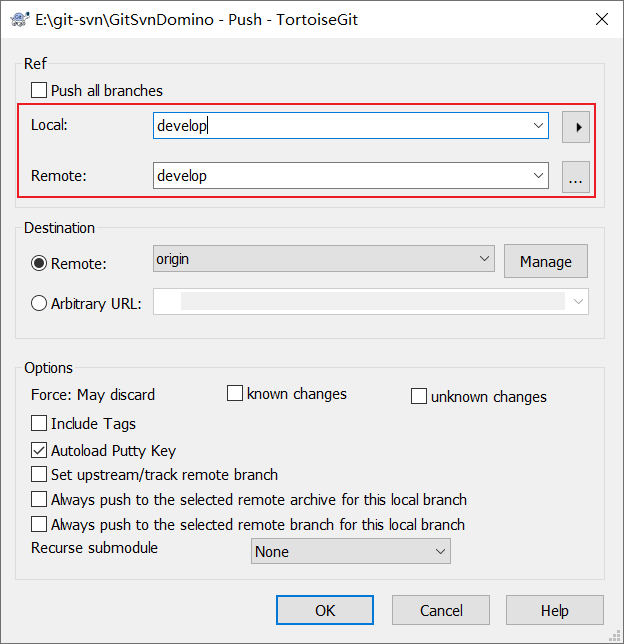
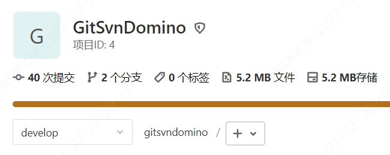

<!-- TOC -->

- [开发相关环境](#开发相关环境)
  - [JDK配置](#jdk配置)
  - [maven](#maven)
    - [nexus搭建私服](#nexus搭建私服)
  - [tomcat配置](#tomcat配置)
  - [springboot部署](#springboot部署)
  - [内核升级](#内核升级)
  - [docker安装](#docker安装)
    - [离线安装docker-ce](#离线安装docker-ce)
  - [gitlab](#gitlab)
    - [修改端口号](#修改端口号)
    - [安装流水线runner](#安装流水线runner)
    - [ci-yml配置](#ci-yml配置)
    - [jenkins](#jenkins)
  - [svn-git迁移](#svn-git迁移)
  - [rpm](#rpm)
  - [nodejs环境](#nodejs环境)
  - [nginx服务器](#nginx服务器)
  - [jenkins](#jenkins-1)
    - [jenkins plugin 离线](#jenkins-plugin-离线)
    - [执行shell](#执行shell)
    - [结合gitlab定时构建](#结合gitlab定时构建)

<!-- /TOC -->

<a id="markdown-开发相关环境" name="开发相关环境"></a>
# 开发相关环境

<a id="markdown-jdk配置" name="jdk配置"></a>
## JDK配置

使用rz命令将离线jdk安装文件上传至【/usr/local/software】路径

```bash
# 创建目录，-p 表示如果没有上级目录的话一并创建
mkdir -p /usr/lib/jvm

# 解压
tar -zxvf jdk-8u202-linux-x64.tar.gz -C /usr/lib/jvm/
```

- 环境变量的设置

```bash
# 设置环境变量
vi /etc/profile
```

在【profile】文件开头添加内容：

```bash
export JAVA_HOME=/usr/lib/jvm/jdk1.8.0_202
export JRE_HOME=${JAVA_HOME}/jre
export CLASSPATH=.:${JAVA_HOME}/lib:${JRE_HOME}/lib
export PATH=${JAVA_HOME}/bin:$PATH
```

执行【profile】，使之生效：

```bash
source /etc/profile

# 测试环境
java -version
```

<a id="markdown-maven" name="maven"></a>
## maven

https://archive.apache.org/dist/maven/maven-3/

`vi /etc/profile`设置环境变量：

```shell
export MAVEN_HOME=/usr/local/maven/apache-maven-3.6.3
export PATH=$MAVEN_HOME/bin:$PATH
```

<a id="markdown-nexus搭建私服" name="nexus搭建私服"></a>
### nexus搭建私服

https://www.cnblogs.com/knowledgesea/p/11190579.html


<a id="markdown-tomcat配置" name="tomcat配置"></a>
## tomcat配置

> https://tomcat.apache.org/download-90.cgi 

下载安装包，拷贝至 【/usr/local/software】，解压至lib目录：

```bash
tar -zxvf apache-tomcat-9.0.37.tar.gz -C /usr/lib/
```

执行【startup.sh】

```bash
# 打开 bin 目录
cd /usr/lib/apache-tomcat-9.0.37/bin/

# 启动Tomcat
./startup.sh
```

> https://blog.csdn.net/lcyaiym/article/details/76696192


```bash
# CentOS 7.0默认使用的是firewall作为防火墙

# 关闭firewall：
systemctl stop firewalld.service #停止firewall
systemctl disable firewalld.service #禁止firewall开机启动
firewall-cmd --state #查看默认防火墙状态（关闭后显示 notrunning ，开启后显示 running ）
```

<a id="markdown-springboot部署" name="springboot部署"></a>
## springboot部署

区分 war 和 jar 部署方式区别：

> https://blog.csdn.net/weixin_39274753/article/details/81557501

<a id="markdown-内核升级" name="内核升级"></a>
## 内核升级

```bash
# 查看os版本
cat /etc/issue

# 查看内核版本
uname -r
```

由于 docker 对于 CentOS 的内核有要求，内核版本必须高于 3.8

先升级nss (Network Security Service, 网络安全服务)

```bash
yum update nss
```

升级内核需要使用elrepo的yum源，在安装yum源之前还需要我们导入elrepo的key，如下：

```bash
rpm --import https://www.elrepo.org/RPM-GPG-KEY-elrepo.org

yum install https://www.elrepo.org/elrepo-release-6.el6.elrepo.noarch.rpm
```

elrepo的key安装完毕后，我们下面开始正式升级内核。

在yum的elrepo源中有ml和lt两种内核，其中ml(mainline)为最新版本的内核，lt为长期支持的内核。

```bash
# 如果要安装ml内核，使用如下命令：
yum --enablerepo=elrepo-kernel -y install kernel-ml

# 如果要安装lt内核，使用如下命令：
yum --enablerepo=elrepo-kernel -y install kernel-lt
```

内核升级完毕后，不会立即生效，还需要我们修改grub.conf文件。

内核升级完毕后，需要我们修改内核的启动顺序，默认启动的顺序应该为1,升级以后内核是往前面插入为0，如下：

```bash
vi /etc/grub.conf
```

修改默认启动内核：`default=0`，重启后检查内核：

```bash
uname -r
```

参考：
>http://elrepo.org/tiki/tiki-index.php

>https://www.cnblogs.com/ilanni/p/6158519.html


<a id="markdown-docker安装" name="docker安装"></a>
## docker安装

yum 安装docker No package docker available

yum 没有找到docker包，更新epel第三方软件库，运行命令：

CentOS 6.x 版本
```bash
wget https://dl.fedoraproject.org/pub/epel/epel-release-latest-6.noarch.rpm

yum install epel-release

yum install -y yum-utils device-mapper-persistent-data lvm2

yum-config-manager --add-repo http://mirrors.aliyun.com/docker-ce/linux/centos/docker-ce.repo

# 安装docker-ce社区版足够了
yum -y install docker-ce
```

CentOS 7.x
```bash
# 安装必要的yum工具
yum install -y yum-utils device-mapper-persistent-data lvm2

# 添加软件源信息
yum-config-manager --add-repo https://mirrors.ustc.edu.cn/docker-ce/linux/centos/docker-ce.repo
```

之后就可以愉快地安装了。

```bash
yum -y install docker-ce
```

<a id="markdown-离线安装docker-ce" name="离线安装docker-ce"></a>
### 离线安装docker-ce

> https://blog.csdn.net/GentleLin/article/details/90294324


离线rmp包下载地址：

> https://download.docker.com/linux/centos/7/aarch64/stable/Packages/

<a id="markdown-gitlab" name="gitlab"></a>
## gitlab

gitlab-ce 离线下载地址：https://packages.gitlab.com/gitlab/gitlab-ce

https://blog.csdn.net/a3512740/article/details/106620513

gitlab依赖于policycoreutils-python，继而又依赖于以下包：

```
[root@KG-HRDG-34 gitlab]# rpm -ivh policycoreutils-python-2.5-34.el7.x86_64.rpm 
警告：policycoreutils-python-2.5-34.el7.x86_64.rpm: 头V3 RSA/SHA256 Signature, 密钥 ID f4a80eb5: NOKEY
错误：依赖检测失败：
	audit-libs-python >= 2.1.3-4 被 policycoreutils-python-2.5-34.el7.x86_64 需要
	checkpolicy 被 policycoreutils-python-2.5-34.el7.x86_64 需要
	libapol.so.4()(64bit) 被 policycoreutils-python-2.5-34.el7.x86_64 需要
	libapol.so.4(VERS_4.0)(64bit) 被 policycoreutils-python-2.5-34.el7.x86_64 需要
	libcgroup 被 policycoreutils-python-2.5-34.el7.x86_64 需要
	libqpol.so.1()(64bit) 被 policycoreutils-python-2.5-34.el7.x86_64 需要
	libqpol.so.1(VERS_1.2)(64bit) 被 policycoreutils-python-2.5-34.el7.x86_64 需要
	libqpol.so.1(VERS_1.4)(64bit) 被 policycoreutils-python-2.5-34.el7.x86_64 需要
	libsemanage-python >= 2.5-14 被 policycoreutils-python-2.5-34.el7.x86_64 需要
	policycoreutils = 2.5-34.el7 被 policycoreutils-python-2.5-34.el7.x86_64 需要
	python-IPy 被 policycoreutils-python-2.5-34.el7.x86_64 需要
	setools-libs >= 3.3.8-4 被 policycoreutils-python-2.5-34.el7.x86_64 需要
```

需要手动下载相关的rpm包，并执行`rpm -ivh xxxx.rpm`安装命令或`rpm -Uvh xxx.rpm --nodeps`升级命令

总共需要下载以下rpm依赖包：

```
audit-2.8.5-4.el7.x86_64.rpm
audit-libs-2.8.5-4.el7.x86_64.rpm
audit-libs-python-2.8.5-4.el7.x86_64.rpm
checkpolicy-2.5-8.el7.x86_64.rpm
glibc-2.17-317.el7.x86_64.rpm
glibc-common-2.17-317.el7.x86_64.rpm
libcgroup-0.41-21.el7.x86_64.rpm
libsemanage-python-2.5-14.el7.x86_64.rpm
policycoreutils-2.5-34.el7.x86_64.rpm
policycoreutils-python-2.5-34.el7.x86_64.rpm
python-IPy-0.75-6.el7.noarch.rpm
setools-libs-3.3.8-4.el7.x86_64.rpm
```

超级管理员：`root/Admin@123`

```shell
gitlab-ctl reconfigure # 重新配置应用
gitlab-ctl restart # 重启所有服务
```

<a id="markdown-修改端口号" name="修改端口号"></a>
### 修改端口号
默认端口号为80，可能会存在占用等情况，按如下修改端口，否则会出现502异常

`vi /etc/gitlab/gitlab.rb`

```shell
external_url 'http://192.168.217.100:10000'

unicorn['listen']='127.0.0.1'
unicorn['port'] = 10000

nginx['listen_addresses'] = ['*']
nginx['listen_port'] = 10000
```

<a id="markdown-安装流水线runner" name="安装流水线runner"></a>
### 安装流水线runner

下载离线资源包： https://docs.gitlab.com/runner/install/linux-manually.html

【gitlab-runner_amd64.rpm】依赖于git

```shell
# 查看各个 Runner 的状态
gitlab-runner list

# 按名称删除 runner
gitlab-runner verify --delete --name xxx
```

<a id="markdown-ci-yml配置" name="ci-yml配置"></a>
### ci-yml配置
每次调剂或合并会出发pipeline（流水线）操作，该操作取决于【.gitlab-ci.yml】配置文件

针对控制台型应用程序应使用：

```yml

```

<a id="markdown-jenkins" name="jenkins"></a>
### jenkins

https://blog.csdn.net/ruangong1203/article/details/73065410

<a id="markdown-svn-git迁移" name="svn-git迁移"></a>
## svn-git迁移
由于服务器的变动和研发体系的建立，已有的svn仓库需要迁移至git版本管理，操作如下：

1. 账号对应

SVN使用的是用户账号展示的提交记录，但是git使用的是账号和邮箱进行人员确认的，因此我们需要使用将二者进行对应。

新建文本文件【svn2git.txt】：

```
wangyuanwei=wangyuanwei <wangyuanwei@xxxx.com>
zhangsan=zhangsan <zhangsan@xxxx.com>
```

等号左边是SVN账号，等号右边是Gitlab账号和邮箱信息（注意：svn中不存在的人员也得转换，否则报错）。

2. git-svn命令拉取

git内置了一个git-svn的工具，你可以用git-svn按照git的方式来管理svn项目

`git svn clone "你的SVN项目的url" --no-metadata --authors-file="d:/svn2git.txt" 项目名 --username=xxx`

其中`username`是svn中具有访问权限的账号，以下为真实案例迁移至gitlab仓库：

```
git svn clone "https://127.0.0.1:10443/svn/Domino" --no-metadata --authors-file="e:/git-svn/svn2git.txt" GitSvnDomino --username=wangyuanwei

svn_address 即为待迁移svn的工程地址；
–no-metadata 防止git拉取无用的SVN附加信息；
–authors-file 指定用户映射文件，即第一步里生成的文件；
local_dir 为本地存放该svn工程目录，若不存在，git会自行创建；
–username 即为使用指定用户拉取代码，因此该用户必须要有拉取代码的权限。
```

从本机svn仓库到本机的【GitSvnDomino】仓库

3. git-remote配置

添加当前仓库的git用户名和邮箱信息：

```
git config --local user.name "wangyuanwei"
git config --local user.email "wangyuanwei@cheryholding.com"
```

添加远程仓库信息：

```
git remote add origin http://192.168.217.100:10000/dev/gitsvndomino.git
```

4. gitlab push

按规范操作，master分支应该是每个发布版本，develop是开发分支。

在本地创建develop分支，并提交至服务端develop分支，服务端master分支不允许直接提交操作。



推送develop分支成功：



<a id="markdown-rpm" name="rpm"></a>
## rpm

rmp包依赖下载：https://pkgs.org/

<a id="markdown-nodejs环境" name="nodejs环境"></a>
## nodejs环境

下载地址：https://nodejs.org/en/download/

在windows端解压为【node-v14.16.0-linux-x64.tar】tar包，否则还需要在centos端使用xz命令进行解压。

上传该tar包至【/usr/nodejs】

centos端执行命令：

```
tar -xf node-v14.16.0-linux-x64.tar
```

解包后，使用ln命令建立链接：

```
ln -s /usr/nodejs/node-v14.16.0-linux-x64/bin/node /usr/bin/node
ln -s /usr/nodejs/node-v14.16.0-linux-x64/bin/node /usr/bin/npm
ln -s /usr/nodejs/node-v14.16.0-linux-x64/bin/node /usr/bin/npx
```

测试node安装：

```
node -v
npm
npx
```

<a id="markdown-nginx服务器" name="nginx服务器"></a>
## nginx服务器

下载地址：http://nginx.org/packages/centos/7/x86_64/RPMS/

执行安装命令：

```shell
rpm -ivh nginx-1.8.1-1.el7.ngx.x86_64.rpm
```

安装目录为：【/etc/nginx】，通过命令`nginx`启动后，通过ip访问即可看到Nginx的测试页面。

常用命令：

命令 | 功能
---|---
nginx | 启动
nginx -s stop | 快速关闭
nginx -s quit | 优雅的关闭，主进程会等待 worker 进程完成当前用户请求的处理
nginx -t | 查看配置文件是否修改成功 (多用于配置文件修改之后)
nginx -s reopen | 重新打开日志文件
nginx -s reload | 重新启动
nginx -c filename | 使用指定的配置文件 (default: /etc/nginx/nginx.conf)

<a id="markdown-jenkins-1" name="jenkins-1"></a>
## jenkins

下载地址： http://mirrors.jenkins-ci.org/

默认端口：8080，默认JENKINS_HOME目录：`～/.jenkins`

```shell
# 前台启动命令
java -jar jenkins.war

# 后台启动命令
nohup java -jar jenkins.war --httpPort=18080
```

关闭jenkins，页面访问地址：http://ip:port/exit

重启jenkins，页面访问地址：http://ip:port/restart

通常采用shell脚本方式进行启动和停止，方便操作，脚本如下：

默认生成目录【/root/.jenkins】，修改环境变量调整至软件同路径，方便后续的备份及操作:

```shell
vi /etc/profile
```

增加以下内容：

```shell
export JENKINS_HOME=/usr/local/jenkins/.jenkins
```

`source /etc/profile`使修改生效

```shell
#!/bin/bash
### 主要目的用于开机启动服务,不然 启动jenkins.war包没有java -jar的权限
JAVA_HOME=/usr/lib/jvm/jdk1.8.0_202
JENKINS_HOME=/usr/local/jenkins/.jenkins 

pid=`ps -ef | grep jenkins.war | grep -v 'grep'| awk '{print $2}'| wc -l`
  if [ "$1" = "start" ];then
  if [ $pid -gt 0 ];then
  echo 'jenkins is running...'
else
  ### java启动服务 配置java安装根路径,和启动war包存的根路径
  nohup $JAVA_HOME/bin/java -jar /usr/local/jenkins/jenkins.war --httpPort=18080  2>&1 &
  fi
  elif [ "$1" = "stop" ];then
  exec ps -ef | grep jenkins | grep -v grep | awk '{print $2}'| xargs kill -9
  echo 'jenkins is stop..'
else
  echo "Please input like this:"./jenkins.sh start" or "./jenkins stop""
  fi
```

```shell
# 第一次运行需要增加执行权限
chmod +x /usr/local/jenkins/jenkins.sh
chmod +x /usr/local/jenkins/jenkins.war

/usr/local/jenkins/jenkins.sh stop

/usr/local/jenkins/jenkins.sh stop
```


<a id="markdown-jenkins-plugin-离线" name="jenkins-plugin-离线"></a>
### jenkins plugin 离线

插件索引：https://plugins.jenkins.io/

下载地址：http://updates.jenkins-ci.org/download/plugins/

或者在可以联网环境下载plugin依赖，然后将依赖拷贝至指定服务器的指定repository路径。


<a id="markdown-执行shell" name="执行shell"></a>
### 执行shell

jenkins job 执行 mvn 命令时会报 “未知命令”，需要添加 `#!/bin/sh -l` 命令修改为登录方式即可解决问题

执行mvn打包命令：

```shell
#!/bin/sh -l
# 离线打包模式，需要提前将依赖拷贝至离线服务器（TODO临时方案）
mvn -o clean package
```

执行发布命令：

```shell
#!/bin/bash
#这里可替换为你自己的执行程序，其他代码无需更改
JAR_NAME=$2
APP_NAME=/opt/workspace/kg-cloud-publish/${JAR_NAME}

#使用说明，用来提示输入参数
usage() {
    echo "Usage: sh deploy.sh [start|stop|restart|status] xxxx.jar"
    exit 1
}

#检查程序是否在运行
is_exist() {
    pid=`ps -ef | grep $APP_NAME | grep -v grep | awk '{print $2}' `
    #如果不存在返回1，存在返回0
    if [ -z "${pid}" ]; then
      return 1
    else
      return 0
    fi
}

#启动方法
start() {
   is_exist
   if [ $? -eq "0" ]; then
     echo "${APP_NAME} is already running. pid=${pid} ."
   else
     nohup java -Dfile.encoding=utf-8 -jar $APP_NAME > ${JAR_NAME}.log 2>&1 &
	 echo "${APP_NAME} is running."
   fi
}

#停止方法
stop() {
   is_exist
   if [ $? -eq "0" ]; then
     kill -9 $pid
	 echo "kill success!"
   else
     echo "${APP_NAME} is not running"
   fi
}

#输出运行状态
status() {
   is_exist
   if [ $? -eq "0" ]; then
     echo "${APP_NAME} is running. Pid is ${pid}"
   else
     echo "${APP_NAME} is not running."
   fi
}

#重启
restart() {
   stop
   start
}

#根据输入参数，选择执行对应方法，不输入则执行使用说明
case "$1" in
   "start")
     start
     ;;
   "stop")
     stop
     ;;
   "status")
     status
     ;;
   "restart")
     restart
     ;;
   *)
     usage
     ;;
esac

```

调用方式：

```shell
# 启动/停止/查看状态，相应日志为 xxxx.jar.log
sh deploy.sh start/stop/status xxxx.jar
```


<a id="markdown-结合gitlab定时构建" name="结合gitlab定时构建"></a>
### 结合gitlab定时构建

https://www.cnblogs.com/yanjieli/p/10613212.html

